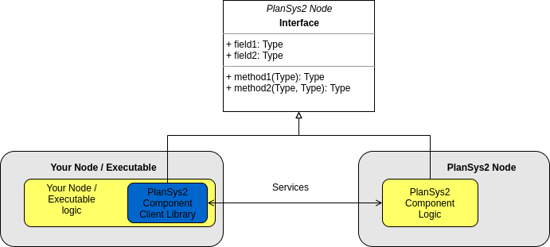
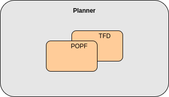
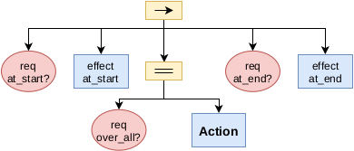
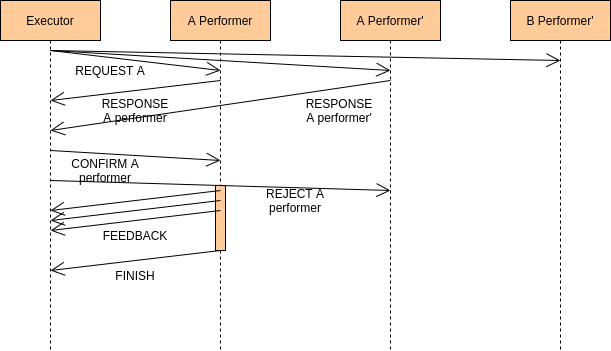

.. _design:

PlanSys2 design
###############

.. image:: images/plansys2_arch.png
    :width: 800px
    :align: center

PlanSys2 has a modular design. It is basically composed of 4 nodes:

* **Domain Expert**: Contains the PDDL model information (types, predicates, functions, and actions). 
* **Problem Expert**: Contains the current instances, predicates, functions, and goals that compose the model.
* **Planner**: Generates plans (sequence of actions) using the information contained in the Domain and Problem Experts.
* **Executor**: Takes a plan and executes it by activating the *action performers* (the ROS2 nodes that implement each action).

Each of these nodes exposes its functionality using ROS2 services. Even so, in PlanSys2 we have created a client library that can be used in 
any application and hides the complexity of using ROS2 services. 

1. Domain Expert
****************

The objective of the Domain Expert is to read PDDL domains from files and make them available to the rest of the components. It's static (by now).

Parameters
----------

* ``model_file`` [string]: PDDL model files to load, separates by ":". These models will be merged. This allows for a modular application in which each component/package contributes with part of the PDDL and the action implementation. See `plansys2_multidomain_example <https://github.com/IntelligentRoboticsLabs/ros2_planning_system_examples/tree/master/plansys2_multidomain_example>`_ for more details.

Client API
----------

  .. code-block:: c++

       std::string getName();
       std::vector<std::string> getTypes();
       std::vector<std::string> getConstants(const std::string & type);

       std::vector<plansys2::Predicate> getPredicates();
       std::optional<plansys2::Predicate> getPredicate(const std::string & predicate);

       std::vector<plansys2::Function> getFunctions();
       std::optional<plansys2::Function> getFunction(const std::string & function);

       std::vector<plansys2::Predicate> getDerivedPredicates();
       std::vector<plansys2_msgs::msg::Derived> getDerivedPredicate(const std::string & predicate);

       std::vector<std::string> getActions();
       plansys2_msgs::msg::Action::SharedPtr getAction(const std::string & action);

       std::vector<std::string> getDurativeActions();
       plansys2_msgs::msg::DurativeAction::SharedPtr getDurativeAction(const std::string & action);

       std::string getDomain();

Services
--------

* ``domain_expert/get_domain_name`` [plansys2_msgs::srv::GetDomainName]: Get the name of the domain.
* ``domain_expert/get_domain_types`` [plansys2_msgs::srv::GetDomainTypes]: Get the valid types.
* ``domain_expert/get_domain_actions`` [plansys2_msgs::srv::GetDomainActions]: Get the available actions.
* ``domain_expert/get_domain_action_details`` [plansys2_msgs::srv::GetDomainActionDetails]: Get the details of a specific action.
* ``domain_expert/get_domain_durative_actions`` [plansys2_msgs::srv::GetDomainDurativeActions]: Get the available durative actions.
* ``domain_expert/get_domain_durative_action_details`` [plansys2_msgs::srv::GetDomainDurativeActionDetails]: Get the details of a specific durative action.
* ``domain_expert/get_domain_predicates`` [plansys2_msgs::srv::GetDomainPredicates]: Get the valid predicates.
* ``domain_expert/get_domain_predicate_details`` [plansys2_msgs::srv::GetDomainPredicateDetails]: Get the details of a specific predicate.
* ``domain_expert/get_domain_functions`` [plansys2_msgs::srv::GetDomainFunctions]: Get the valid functions.
* ``domain_expert/get_domain_function_details`` [plansys2_msgs::srv::GetDomainFunctionDetails]: Get the details of a specific function.
* ``domain_expert/get_domain_derived_predicates`` [plansys2_msgs::srv::GetDomainDerivedPredicates]: Get the valid derived predicates.
* ``domain_expert/get_domain_derived_predicate_details`` [plansys2_msgs::srv::GetDomainDerivedPredicateDetails]: Get the details of a specific derived predicate.
* ``domain_expert/get_domain`` [plansys2_msgs::srv::GetDomain]: Get the PDDL domain as a string.

Publishers / Subscriber
-----------------------

* ``domain_expert/domain`` [std_msgs::msg::String] {Publisher: rclcpp::QoS(100).transient_local()}: A message is published on this topic with the current domain.

1. Problem Expert
*****************

Contains the knowledge of the system: instances, grounded predicates and functions, and goals.

Parameters
----------

* ``model_file`` [string]: PDDL model files to load, separates by ":". These models will be merged. This allows for a modular application in which each component/package contributes with part of the PDDL and the action implementation. See `plansys2_multidomain_example <https://github.com/IntelligentRoboticsLabs/ros2_planning_system_examples/tree/master/plansys2_multidomain_example>`_ for more details.

Client API
----------

  .. code-block:: c++

         std::vector<plansys2::Instance> getInstances();
         bool addInstance(const plansys2::Instance & instance);
         bool removeInstance(const plansys2::Instance & instance);
         std::optional<plansys2::Instance> getInstance(const std::string & name);

         std::vector<plansys2::Predicate> getPredicates();
         bool addPredicate(const plansys2::Predicate & predicate);
         bool removePredicate(const plansys2::Predicate & predicate);
         bool existPredicate(const plansys2::Predicate & predicate);
         std::optional<plansys2::Predicate> getPredicate(const std::string & predicate);

         std::vector<plansys2::Function> getFunctions();
         bool addFunction(const plansys2::Function & function);
         bool removeFunction(const plansys2::Function & function);
         bool existFunction(const plansys2::Function & function);
         bool updateFunction(const plansys2::Function & function);
         std::optional<plansys2::Function> getFunction(const std::string & function);

         plansys2::Goal getGoal();
         bool setGoal(const plansys2::Goal & goal);
         bool isGoalSatisfied(const plansys2::Goal & goal);

         bool clearGoal();
         bool clearKnowledge();

         std::string getProblem();
         bool addProblem(const std::string & problem_str);

Services
--------

* ``problem_expert/add_problem`` [plansys2_msgs::srv::AddProblem]: Add a problem to the current knowledge.
* ``problem_expert/add_problem_goal`` [plansys2_msgs::srv::AddProblemGoal]: Replace the goal.
* ``problem_expert/add_problem_instance`` [plansys2_msgs::srv::AffectParam]: Add an instance.
* ``problem_expert/add_problem_predicate`` [plansys2_msgs::srv::AffectNode]: Add a predicate.
* ``problem_expert/add_problem_function`` [plansys2_msgs::srv::AffectNode]: Add a function.
* ``problem_expert/get_problem_goal`` [plansys2_msgs::srv::GetProblemGoal]: Get the current goal.
* ``problem_expert/get_problem_instance`` [plansys2_msgs::srv::GetProblemInstanceDetails]: Get the details of an instance.
* ``problem_expert/get_problem_instances`` [plansys2_msgs::srv::GetProblemInstances]: Get all the instances.
* ``problem_expert/get_problem_predicate`` [plansys2_msgs::srv::GetNodeDetails]: Get the details of a predicate.
* ``problem_expert/get_problem_predicates`` [plansys2_msgs::srv::GetStates]: Get all the predicates.
* ``problem_expert/get_problem_function`` [plansys2_msgs::srv::GetNodeDetails]: Get the details of a function.
* ``problem_expert/get_problem_functions`` [plansys2_msgs::srv::GetStates]: Get all the functions.
* ``problem_expert/get_problem`` [plansys2_msgs::srv::GetProblem]: Get the PDDL problem as a string.
* ``problem_expert/remove_problem_goal`` [plansys2_msgs::srv::RemoveProblemGoal]: Remove the current goal.
* ``problem_expert/remove_problem_instance`` [plansys2_msgs::srv::AffectParam]: Remove an instance.
* ``problem_expert/remove_problem_predicate`` [plansys2_msgs::srv::AffectNode]: Remove a predicate.
* ``problem_expert/remove_problem_function`` [plansys2_msgs::srv::AffectNode]: Remove a function.
* ``problem_expert/clear_problem_knowledge`` [plansys2_msgs::srv::ClearProblemKnowledge]: Clears the instances, predicates, and functions.
* ``problem_expert/exist_problem_predicate`` [plansys2_msgs::srv::ExistNode]: Check if a predicate exists.
* ``problem_expert/exist_problem_function`` [plansys2_msgs::srv::ExistNode]: Check if a function exists.
* ``problem_expert/update_problem_function`` [plansys2_msgs::srv::AffectNode]: Update a function value.
* ``problem_expert/is_problem_goal_satisfied`` [plansys2_msgs::srv::IsProblemGoalSatisfied]: Check if a goal is satisfied.

Publishers / Subscriber
-----------------------

* ``problem_expert/problem`` [plansys2_msgs::msg::Problem] {Publisher: rclcpp::QoS(100)}: A message is published on this topic with the current problem.
* ``problem_expert/update_notify`` [std_msgs::msg::Empty] {Publisher: rclcpp::QoS(100)}: A message is published on this topic when any element of the problem changes.
* ``problem_expert/knowledge`` [plansys2_msgs::msg::Knowledge] {Publisher: rclcpp::QoS(100).transient_local()}: A message is published on this topic when any element of the problem changes.

1. Planner
**********

This component calculates the plan to obtain a goal. 

Each PDDL solver in PlanSys2 is a plugin.
By default PlanSys2 uses `POPF <https://github.com/IntelligentRoboticsLabs/ros2_planning_system/tree/master/plansys2_popf_plan_solver>`_, although other PDDL solvers can be used easily.
Currently, the `Temporal Fast Downward <https://github.com/IntelligentRoboticsLabs/plansys2_tfd_plan_solver>`_ (TFD) solver is also available.

1. A plan may be requested by providing a domain acquired from the Domain Expert and a problem acquired from the Problem expert.
2. The domain is stored in ``<output_dir>/<node namespace>/domain.pddl``. This allows for several PlanSys2 instances in the same machine, which is useful for simulating multiple robots in the same machine.
3. The problem is stored in ``<output_dir>/<node namespace>/problem.pddl``.
4. Run the PDDL Solver, storing the output in ``<output_dir>/<node namespace>/plan.pddl``.
5. Parse ``<output_dir>/<node namespace>/plan.pddl`` to get the sequence of actions as a vector of string.
6. Return the result.

Here, ``<output_dir>`` corresponds to the output directory where the PDDL solver writes files.
For POPF, the default corresponds to your system's temporary directory (e.g., ``/tmp/``), but it can be modified using the ``<plugin_name>.output_dir`` ROS parameter.

Parameters
----------

* ``plan_solver_plugins`` [vector<string>]: List of PDDL solver plugins. Currently, only the first plugin specified will be used. If not set, POPF will be used by default. Check `this config <https://github.com/IntelligentRoboticsLabs/ros2_planning_system/blob/master/plansys2_bringup/params/plansys2_params.yaml>`_ as an example on how to use it.

Client API
----------

  .. code-block:: c++

       std::optional<plansys2_msgs::msg::Plan> getPlan(const std::string & domain, const std::string & problem);
       plansys2_msgs::msg::PlanArray getPlanArray(const std::string & domain, const std::string & problem);

Services
--------

* ``planner/get_plan`` [plansys2_msgs::srv::GetPlan]: Get a plan that will satisfy the provided domain and problem.
* ``planner/get_plan_array`` [plansys2_msgs::srv::GetPlanArray]: Get a plan array that will satisfy the provided domain and problem.
* ``planner/validate_domain`` [plansys2_msgs::srv::ValidateDomain]: Validate the provided domain.

Publishers / Subscriber
-----------------------

None

1. Executor
***********

This component is responsible for executing a provided plan. It is, by far, the most complex component since the execution involves activating the action performers. This task is carried out with the following characteristics:

* It optimizes its execution, parallelizing the actions when possible.
* It checks if the requirements are met at runtime.
* It allows more than one action performer for each action, supporting multirobot execution.

.. image:: images/plansys2_arch2.png
    :width: 600px
    :align: center

Parameters
----------

* ``action_timeouts.actions`` [vector<string>]: List of actions with enabled duration timeout capability. When the duration timeout capability is enabled for a given action, the action will halt after exceeding the action duration by more than a specified percentage. Duration timeouts are not enabled by default. To enable duration timeouts, the user must provide a custom action execution XML behavior tree template that includes the CheckTimeout BT node. Additionally, this parameter must specify the actions for which duration timeouts are enabled. Finally, the duration overrun percentage must be specified for each action.
* ``action_timeouts.<action_name>.duration_overrun_percentage`` [double]: When action duration timeouts are enabled (see explanation above), the duration overrun percentage specifies the amount of time an action is allowed to overrun its duration before halting. The overrun time is defined as a percentage of the action duration specified by the domain.
* ``default_action_bt_xml_filename`` [string]: Filepath to a user provided custom action execution XML behavior tree template. The user can use this template to specify a different XML behavior tree template than the one provided in the plansy2_executor package. Currently the only available BT node not used by the default behavior tree template is the CheckTimeout node.
* ``enable_dotgraph_legend`` [bool]: Enable legend with planning graph in DOT graph plan viewer.
* ``print_graph`` [bool]: Print planning graph to terminal.
* ``enable_groot_monitoring`` [bool]: Enable visualizing the plan's behavior tree inside `Groot <https://github.com/BehaviorTree/Groot>`_.
* ``publisher_port`` [unsigned int]: ZeroMQ publisher port for `Groot <https://github.com/BehaviorTree/Groot>`_.
* ``server_port`` [unsigned int]: ZeroMQ server port for `Groot <https://github.com/BehaviorTree/Groot>`_.
* ``max_msgs_per_second`` [unsigned int]: Maximum number of ZeroMQ messages sent per second to `Groot <https://github.com/BehaviorTree/Groot>`_.

Client API
----------

  .. code-block:: c++

       bool start_plan_execution(const plansys2_msgs::msg::Plan & plan);
       bool execute_and_check_plan();
       void cancel_plan_execution();
       std::vector<plansys2_msgs::msg::Tree> getOrderedSubGoals();
       std::optional<plansys2_msgs::msg::Plan> get_plan();
       std::optional<plansys2_msgs::msg::Plan> get_remaining_plan();

       ExecutePlan::Feedback getFeedBack() {return feedback_;}
       std::optional<ExecutePlan::Result> getResult();

Actions
--------

* ``execute_plan`` [plansys2_msgs::action::ExecutePlan]: Execute the provided plan.

Publishers / Subscriber
-----------------------

* ``dot_graph`` [std_msgs::msg::String] {Publisher: rclcpp::QoS(1)}: Publishes the planning DOT graph.
* ``action_execution_info`` [plansys2_msgs::msg::ActionExecutionInfo] {Publisher: rclcpp::QoS(100)}: Publishes the action execution information. Note that the action execution information is also provided to the ExecutePlan action client via the feedback and result channels.
* ``executing_plan`` [plansys2_msgs::msg::Plan] {Publisher: rclcpp::QoS(100).transient_local()}: Publishes the currently executing plan.
* ``remaining_plan`` [plansys2_msgs::msg::Plan] {Publisher: rclcpp::QoS(100)}: Publishes the remaining plan to be executed.

Behavior Tree builder
*********************

Once a plan is obtained, the Executor converts it to a Behavior Tree to execute it. Each action becomes the following subtree:

The first step is building a planning graph that encodes the action dependencies that define the execution order. This is made
by pairing the effects of an action with a requirement of a posterior action. We take as reference the time of the calculated plan:

.. image:: images/action_deps.png
    :width: 250px
    :align: center

.. image:: images/plan_graph.png
    :width: 200px
    :align: center

Once created the graph, we identify the execution flows:

.. image:: images/graph_flows.png
    :width: 800px
    :align: center

From the red flow, for example, we get:

.. image:: images/red_flow.png
    :width: 400px
    :align: center

Each flow is executed in parallel. There is no problem if flows overlap because the BT that executes an action is implemented following a Singleton-like approach.

Action delivery protocol
************************

In the first implementations of PlanSys2, the delivery of actions was done using ROS2 actions. This approach has currently been discarded as it is not flexible enough. 
Instead, a bidding-based delivery protocol has been developed in the ``ActionExecutor`` and ``ActionExecutorClient`` classes that uses the ``plansys2_msgs::msg::ActionExecution`` message.

When the Executor must execute an action, it requests which action performer can execute it. Those who can 
reply to this request. The Executor confirms one of them (the first to answer), rejecting the rest. If none are found, repeat the request every second until you give up, aborting the 
execution of the plan. This protocol uses the topic ``/action_hub``, where you can monitor the execution of the system.

All the action performers inherit from ``ActionExecutorClient``, that is a ROS2 Node with the next information:

Parameters
----------

* ``~/action`` [string]: The action managed. This action performer discard any request non equal to this parameter.
* ``~/specialized_arguments`` [vector<string>]: If this parameter is not void, it only replies to action request that contains in any of the arguments any of these values.

.. note::  In a multirobot application, for example, we add to the actions a parameter with the robot that should do the action. In each robot we can execute the same action performer, and using ``~/specialized_arguments`` we can select which will be executed.

Publishers / Subscriber
-----------------------

* ``/actions_hub`` [plansys2_msgs::msg::ActionExecution] {Publisher: rclcpp::QoS(100).reliable()}: Receive messages from the Action Hub.
* ``/actions_hub`` [plansys2_msgs::msg::ActionExecution] {Subscriber: rclcpp::QoS(100).reliable()}: Publish messages to the Action Hub.
