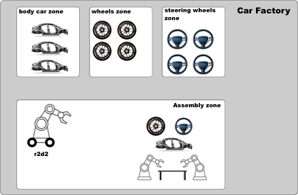
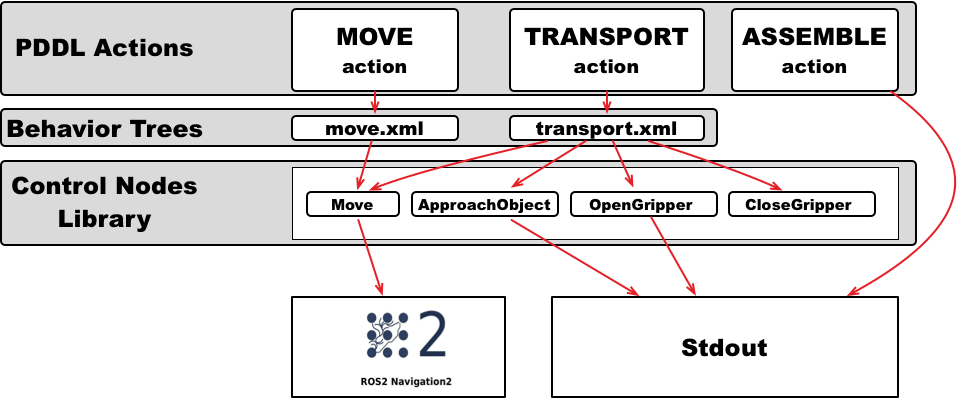

.. _bt_actions:

Implement actions as Behavior Trees
***********************************

.. raw:: html

    <h1 align="center">
      

        

          <iframe width="450" height="300" src="https://www.youtube.com/embed/_oCcIq-TN_0?autoplay=1&mute=1" frameborder="1" allowfullscreen></iframe>
        

      

    </h1>

- `Overview`_
- `Tutorial Steps`_

Overview
========

`Behavior Trees <https://en.wikipedia.org/wiki/Behavior_tree_(artificial_intelligence,_robotics_and_control)>`_ are a great way to implement actions. Instead of implementing an action, we specify an xml file with the structure of a behavior 
Tree and implement the tree nodes. This allows you to easily modify the implementation of an action, and reuse the nodes that are part of it in different behavior trees.

In PlanSys2 we will use the `BehaviorTree.CPP <https://www.behaviortree.dev/>`_ package from `Davide Faconti <https://github.com/facontidavide>`_. Read the tutorials there to 
learn more control nodes and so more sohisticated actions.

In this tutorial we are going to see an example of a car assembly factory. The robots in this factory must transport the parts of a car from the areas where they are stored to the assembly area, in order to assemble a car.

You can find the PDDL domain of this tutorial `in this file <https://github.com/IntelligentRoboticsLabs/ros2_planning_system_examples/blob/master/plansys2_bt_example/pddl/bt_example.pddl>`_.

Tutorial Steps
==============

0- Requisites
-------------

If you haven't done yet, clone in your workspace and build the |PN| `examples <https://github.com/IntelligentRoboticsLabs/ros2_planning_system_examples>`_

  .. code-block:: bash

      cd <your_workspace>
      git clone -b <ros2-distro>-devel https://github.com/IntelligentRoboticsLabs/ros2_planning_system_examples.git src
      colcon build --symlink-install
      rosdep install --from-paths src --ignore-src -r -y
      colcon build --symlink-install

1- Running the example
----------------------

* Open a new terminal and run |PN|:

   .. code-block:: bash

      ros2 launch plansys2_bt_example plansys2_bt_example_launch.py

* You have two options: you can use the real Nav2 package with a simulation or using a Nav2 fake node:

   .. code-block:: bash

      ros2 launch nav2_bringup tb3_simulation_launch.py  # For real Nav2 and Simulation 
      ros2 run plansys2_bt_example nav2_sim_node  # For fake Nav2 node

* In the |PN| terminal shell, copy and paste the next commands to init the knowledge of the system and set the goal:

   .. code-block:: lisp

       > set instance r2d2 robot
       
       > set instance wheels_zone zone
       > set instance steering_wheels_zone zone
       > set instance body_car_zone zone
       > set instance assembly_zone zone
       
       > set instance wheel_1 piece
       > set instance body_car_1 piece
       > set instance steering_wheel_1 piece
       
       > set instance wheel_2 piece
       > set instance body_car_2 piece
       > set instance steering_wheel_2 piece
       
       > set instance wheel_3 piece
       > set instance body_car_3 piece
       > set instance steering_wheel_3 piece
       
       > set instance car_1 car
       > set instance car_2 car
       > set instance car_3 car
       
       > set predicate (robot_at r2d2 wheels_zone)
       > set predicate (is_assembly_zone assembly_zone)
              
       > set predicate (piece_at wheel_1 assembly_zone)
       > set predicate (piece_at body_car_1 assembly_zone)
       > set predicate (piece_at steering_wheel_1 assembly_zone)
       
       > set predicate (piece_is_wheel wheel_1)
       > set predicate (piece_is_body_car body_car_1)
       > set predicate (piece_is_steering_wheel steering_wheel_1)
       > set predicate (piece_not_used wheel_1)
       > set predicate (piece_not_used body_car_1)
       > set predicate (piece_not_used steering_wheel_1)
       
       > set goal (and(car_assembled car_1))
       > run

2- Using Behavior Trees
-----------------------

In the PDDL domain we have three actions: assemble, move and transport. We will implement the assemble action without using BTs, as we have done in the previous tutorials. 
We will implement the other two PDDL actions, ``Move`` and ``Transport``, using BTs. For this, each action will have a BT encoded in an XML file that. This XML file contains 
the control structures (sequences, fallbacks, ...) and the nodes that carry out the action. In this tutorial, 4 BT nodes have been implemented (``Move``, ``ApproachObject``, 
``OpenGripper``, and ``CloseGripper``) that can be included in the BTs of the PDDL actions.

In PlanSys2 there is a generic executable that any BT can run. This executable is `` bt_action_node` from the package `` plansys2_bt_actions``. To use it, we should add it in 
the launch file, specifying as parametersthe XML file that contains the BT and the PDDL action name:

  .. code-block:: python

       move_cmd = Node(
           package='plansys2_bt_actions',
           executable='bt_action_node',
           name='move',
           namespace=namespace,
           output='screen',
           parameters=[
             example_dir + '/config/params.yaml',
             {
               'action_name': 'move',
               'bt_xml_file': example_dir + '/behavior_trees_xml/move.xml'
             }
           ])
 
The ``params.yaml`` contains the BT nodes that will be used in the BT. As we implement each BT as plugins, it is necessary to specify each custom node used. We can also include 
any parameter needed by the specific BT node. In this case, the coordinates of each room is specified to the BT node ``move`` using parameters:

  .. code-block:: yaml

       move:
         ros__parameters:
           plugins:
             - plansys2_move_bt_node
           waypoints: ["wheels_zone", "steering_wheels_zone", "body_car_zone", "assembly_zone"]
           waypoint_coords:
             wheels_zone: [0.0, -2.0, 0.0]
             steering_wheels_zone: [1.8, 0.0, 0.0]
             body_car_zone: [0.0, 2.0, 0.0]
             assembly_zone: [-2.0, -0.4, 0.0]

2.1 PDDL Action move
^^^^^^^^^^^^^^^^^^^^

This is the BT for the **move** action. The sequence is not necessary, but it is mantained in the tutorial to be coherent with the available code. 
It is composed only by one BT node ``Move`` (do not confuse with PDDL action ``move``). 

  .. code-block:: xml

       <root main_tree_to_execute = "MainTree" >
           <BehaviorTree ID="MainTree">
              <Sequence name="root_sequence">
                  <Move    name="move" goal="${arg2}"/>
              </Sequence>
           </BehaviorTree>
       </root>

In PlanSys2, the arguments of the PDDL action are accesible in the XML throught values in the blackboard whise identififiers are ``arg0``, ``arg1``, ``arg2``, and so on. If executing the 
PDDL action ``(move r2d2 corridor kitchen)``, ``arg2`` is the destiny room ``kitchen``.

2.2 PDDL Action transport
^^^^^^^^^^^^^^^^^^^^^^^^^

This is the BT for the **transport** action. It is implemented as a sequence of BT nodes, including reuse the BT node ``Move``. 

  .. code-block:: xml

       <root main_tree_to_execute = "MainTree" >
           <BehaviorTree ID="MainTree">
              <Sequence name="root_sequence">
                  <OpenGripper    name="open_gripper"/>
                  <ApproachObject name="approach_object"/>
                  <CloseGripper   name="close_gripper"/>
                  <Move    name="move" goal="${arg3}"/>
                  <OpenGripper    name="open_gripper"/>
              </Sequence>
           </BehaviorTree>
       </root>

2.3 BT Nodes
^^^^^^^^^^^^

We implemented 4 BT nodes for this tutorial. ``ApproachObject``, ``OpenGripper``, and ``CloseGripper`` have a similar implementation, showing only a message in the terminal when executing:

  .. code-block:: c++

       class ApproachObject : public BT::ActionNodeBase
       {
       public:
         explicit ApproachObject(
           const std::string & xml_tag_name,
           const BT::NodeConfiguration & conf);
       
         void halt();
         BT::NodeStatus tick();
       
         static BT::PortsList providedPorts()
         {
           return BT::PortsList({});
         }
       
       private:
         int counter_;
       };

  .. code-block:: c++

       ApproachObject::ApproachObject(
         const std::string & xml_tag_name,
         const BT::NodeConfiguration & conf)
       : BT::ActionNodeBase(xml_tag_name, conf), counter_(0)
       {
       }
       
       void
       ApproachObject::halt()
       {
         std::cout << "ApproachObject halt" << std::endl;
       }
       
       BT::NodeStatus
       ApproachObject::tick()
       {
         std::cout << "ApproachObject tick " << counter_ << std::endl;
       
         if (counter_++ < 5) {
           return BT::NodeStatus::RUNNING;
         } else {
           counter_ = 0;
           return BT::NodeStatus::SUCCESS;
         }
       }
       
       }  // namespace plansys2_bt_example
       
       #include "behaviortree_cpp_v3/bt_factory.h"
       BT_REGISTER_NODES(factory)
       {
         factory.registerNodeType<plansys2_bt_example::ApproachObject>("ApproachObject");
       }

For implementing the BT node ``Move``, we make it to inherit from ``BtActionNode<>`` to simplify the implementation when the node calls a ROS2 action. In this case, ``nav2_msgs::action::NavigateToPose``.

  .. code-block:: c++

       class Move : public plansys2::BtActionNode<nav2_msgs::action::NavigateToPose>
       {
       public:
         explicit Move(
           const std::string & xml_tag_name,
           const std::string & action_name,
           const BT::NodeConfiguration & conf);
       
         void on_tick() override;
         BT::NodeStatus on_success() override;
       
         static BT::PortsList providedPorts()
         {
           return {
             BT::InputPort<std::string>("goal")
           };
         }
       
       private:
         int goal_reached_;
         std::map<std::string, geometry_msgs::msg::Pose2D> waypoints_;
       };

``BtActionNode<>`` hides all the complexity, and only it is necessary to implement the method ``on_tick``, called one when the BT node is ticked for first time. In this BT node, we get the destination id from 
the input ``goal`` parameter. Remember the line in the XML ``<Move    name="move" goal="${arg3}"/>``.

  .. code-block:: c++

       void
       Move::on_tick()
       {
         std::string goal;
         getInput<std::string>("goal", goal);
       
         geometry_msgs::msg::Pose2D pose2nav;
         if (waypoints_.find(goal) != waypoints_.end()) {
           pose2nav = waypoints_[goal];
         } else {
           std::cerr << "No coordinate for waypoint [" << goal << "]" << std::endl;
         }
       
         geometry_msgs::msg::PoseStamped goal_pos;
       
         goal_pos.header.frame_id = "map";
         goal_pos.pose.position.x = pose2nav.x;
         goal_pos.pose.position.y = pose2nav.y;
         goal_pos.pose.position.z = 0;
         goal_pos.pose.orientation = tf2::toMsg(tf2::Quaternion({0.0, 0.0, 1.0}, pose2nav.theta));
       
         goal_.pose = goal_pos;
       }

There are also more method that we can implement if needed (``on_success``, ``on_aborted``, ``on_cancelled``, and so on).